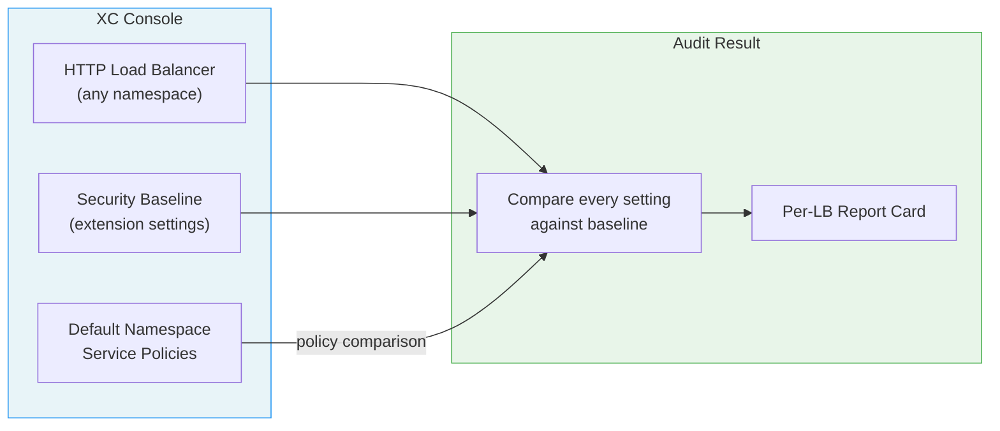
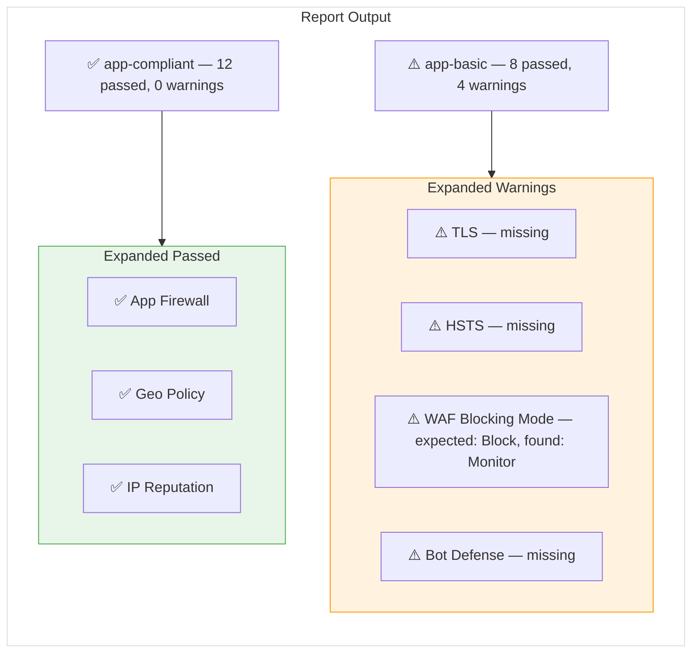
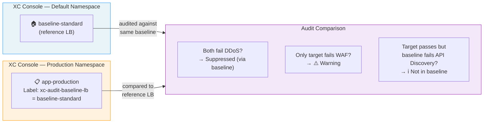
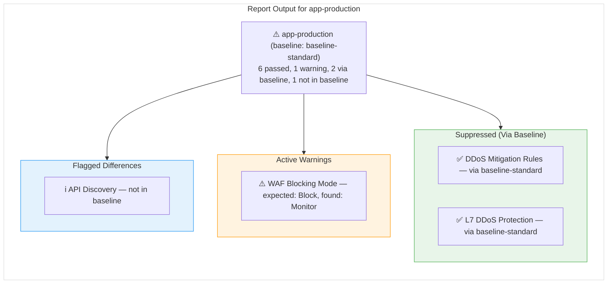
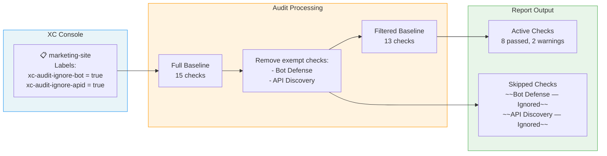
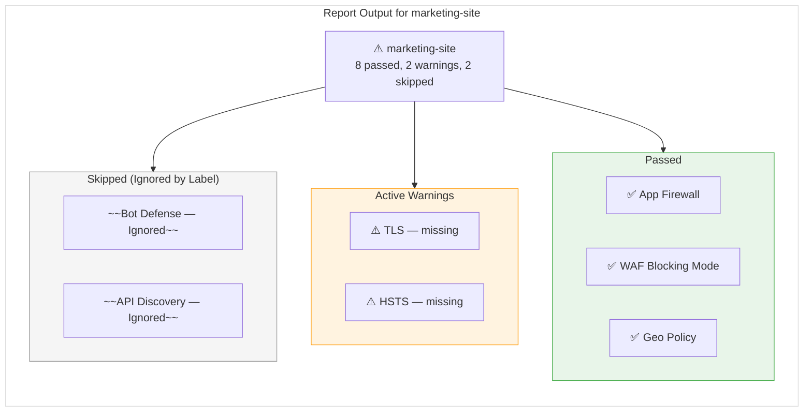

# Audit Scenarios — Configuration Guide

How to configure your load balancers for three common audit scenarios.

---

## Scenario 1: Standard Audit (No Configuration Required)

Every LB is compared against the full security baseline. Service policies are compared against the default namespace.



### What You See in the Report



### Configuration Steps

**None required.** Install the extension or configure the webapp, navigate to the LB list page, and the audit runs automatically.

---

## Scenario 2: Baseline LB Override

A reference LB in the **default** namespace serves as a "known-good" configuration. Other LBs are compared against it — shared gaps are suppressed, and improvements are flagged.



### What You See in the Report



### Configuration Steps

#### Step 1 — Create the Reference LB

Create an HTTP Load Balancer in the **default** namespace that represents your approved configuration (e.g., `baseline-standard`). This LB doesn't need to serve traffic — it's just a configuration template.

#### Step 2 — Add the Label to Target LBs

In the XC Console, navigate to your target LB:

1. **Load Balancers** → select the LB → **Edit**
2. Scroll to **Labels**
3. Add a label:
   - **Key:** `xc-audit-baseline-lb`
   - **Value:** the name of your reference LB (e.g., `baseline-standard`)
4. **Save and Exit**

```
┌─────────────────────────────────────────────────┐
│  Edit HTTP Load Balancer: app-production        │
│                                                 │
│  Labels                                         │
│  ┌───────────────────────┬────────────────────┐ │
│  │ Key                   │ Value              │ │
│  ├───────────────────────┼────────────────────┤ │
│  │ xc-audit-baseline-lb  │ baseline-standard  │ │
│  └───────────────────────┴────────────────────┘ │
│  + Add Label                                    │
│                                                 │
│            [Save and Exit]  [Cancel]            │
└─────────────────────────────────────────────────┘
```

#### How It Works

| Current LB | Baseline LB | Result |
|:---:|:---:|---|
| ⚠️ Fails | ⚠️ Fails | **Suppressed** — shown as "via baseline-standard" |
| ⚠️ Fails | ✅ Passes | **Warning** — LB is worse than baseline |
| ✅ Passes | ⚠️ Fails | **Flagged** — shown as "not in baseline" |
| ✅ Passes | ✅ Passes | **Passed** — both comply |

---

## Scenario 3: Selective Ignore Labels

Skip specific checks for individual LBs using exemption labels. Useful for LBs that intentionally don't need certain features (e.g., a static site that doesn't need Bot Defense).



### What You See in the Report



### Configuration Steps

#### Step 1 — Choose Which Checks to Skip

| Label Key | Skips | Category |
|-----------|-------|----------|
| `xc-audit-ignore-tls` | TLS configuration | Core Security |
| `xc-audit-ignore-hsts` | HSTS headers | Core Security |
| `xc-audit-ignore-iprep` | IP Reputation checks | Core Security |
| `xc-audit-ignore-geo` | Geo Policy checks | Core Security |
| `xc-audit-ignore-trustip` | Trust Client IP Headers | Core Security |
| `xc-audit-ignore-waf` | App Firewall + all WAF inspections | WAF |
| `xc-audit-ignore-mp` | Malware Protection | WAF |
| `xc-audit-ignore-ddos` | DDoS Mitigation + L7 DDoS | DDoS |
| `xc-audit-ignore-bot` | Bot Defense | Bot Defense |
| `xc-audit-ignore-csd` | Client-Side Defense | Bot Defense |
| `xc-audit-ignore-apid` | API Discovery | API Security |
| `xc-audit-ignore-apip` | API Protection + API Testing | API Security |
| `xc-audit-ignore-jwt` | JWT Validation | API Security |
| `xc-audit-ignore-sp` | Service Policies | Policy & Data |
| `xc-audit-ignore-sdp` | Sensitive Data Policy | Policy & Data |

#### Step 2 — Add Labels to the LB

In the XC Console, navigate to your target LB:

1. **Load Balancers** → select the LB → **Edit**
2. Scroll to **Labels**
3. Add one label per check you want to skip:
   - **Key:** `xc-audit-ignore-bot` (from table above)
   - **Value:** `true`
4. **Save and Exit**

```
┌─────────────────────────────────────────────────┐
│  Edit HTTP Load Balancer: marketing-site        │
│                                                 │
│  Labels                                         │
│  ┌───────────────────────┬────────────────────┐ │
│  │ Key                   │ Value              │ │
│  ├───────────────────────┼────────────────────┤ │
│  │ xc-audit-ignore-bot   │ true               │ │
│  ├───────────────────────┼────────────────────┤ │
│  │ xc-audit-ignore-apid  │ true               │ │
│  └───────────────────────┴────────────────────┘ │
│  + Add Label                                    │
│                                                 │
│            [Save and Exit]  [Cancel]            │
└─────────────────────────────────────────────────┘
```

> **Note:** Labels must use the exact keys from the table. The value must be `true`. Custom exemption codes can be defined in the extension's Options page under **Exemption Map**.
